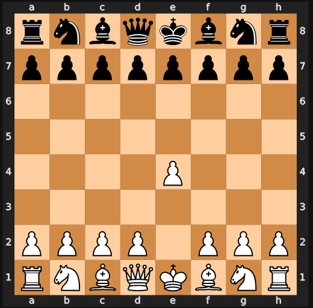

# :chess_pawn:  Capstone-project - Guess the Game!  :chess_pawn: 
By Grandadam Patrik

## Introduction

The picture above illustrates a chessboard after white's first move "e2-e4". However, it is not possible to affirm that the game played is "standard chess".  
Indeed, multiple chess "variants" exist. A variant could be defined as a game that a played on a chess board and which rules are inspired by chess, but that differs from it in some ways. 
Examples of the different variants can be found under https://lichess.org/variant.  

**The goal of this project is to predict the variant that is played on a given chess board after 10 moves.**  

The project will be focus on the 9 variants that can be played on lichess.org. 

## Methdology

### Data Extraction and processing

We start by extracting the data from lichess.org by using its API and the berserk's client (https://berserk.readthedocs.io/en/master/index.html ).  
The data is then cleaned and processed through the following steps:  
- extracting random games, removing aborted games  
- cleaning the data to extract relevant information and convert it to "user-friendly" lists  
- "playing" the moves on a board to get the position after N moves, extracting relevant data from the games  
- extracting the position on the board to obtain an array of length 64 representing the 64 squares of the board and the piece standing on each square  
- encoding to convert each of the 64 squares into binary variables that will be used later in the different models  

The output of this preprocessing steps is a clean dataframe of 1000 observations from each variant (=9000 observations in total). 
The main information contained in this dataframe is the variant played on a given board and multiple encoded features derived from the position after 10 moves.   

### Exploratory Data Analysis

From this dataframe, an EDA is performed. Diagrams of different positions from each variant are plotted and provide us more knowledge on the data. They help us to figure out rules that might have an importance in the prediction task.  
From these first insights, we engineer multiple features and assess their relevance by looking at their distributions in the different variants.  
The results shown are the result of an iterative process:  
- reflection on features that could be helpful based on the graphs and domain knwoledge  
- test of the features  
- improving/removing features and including new features  
- adding the selected features to the final dataframe  

Through this process, it was quickly possible to discover features that discriminate the data well, like the total number of pieces (especially pawns and kings) on the board, the number of trades, the number of checks given or the positionning of certains pieces on key squares.  
This analysis helped to distinguish variants that would be easy to predict as multiple features discriminated them well like racingKings, horde or to a lower extent antichess, atomic and chess960.  
On the other side, other variants seemed much more challenging to predict. Even if some features have proven to vary between the remaining variants, no clear pattern could be distinguished.  
Based on the output of the EDA, we create two dataframes:  
- df_feat_eng that contains only engineered features  
- full_df that contains all features (engineered features + features directly derived from the position = the position of the pieces)  

## Modelling

Multiple strategies are tested to predict the variant of a given game. After having split the data into training and testing set, we use a grid-search cross-validation to tuned hyperparameters in a training step and predict the variants of unseen data in the testing set. The following models are considered : Decision Tree, Logistic Regression, SVM, Random Forest, Neural Networks. These models are applied to the datasets  using different strategies summarized below:  
- Tuning the models on only engineered features, predicting the variant of the testing set and evaluating the accuracy  
- Tuning the models on the whole dataset and predicting the variant of the testing set and evaluating the accuracy  
- Tuning the models using a nested strategy:  
    1. Creating "groups of variants", tuning the models and predicting the group of variant of the testing set (+ iteratively "tuning" the groups of variants, testing different combinations)    
    2. Splitting the testing set into subsets based on the previous prediction  
    3. Predicting the variant for each of the subsets and evaluating the accuracy  
- Using a PCA on the whole dataset, tuning the models, predicting the variant of the testing set and evaluating the accuracy    
- Using a neural network on a bigger sample of 5000 games per variant

While the overall objective is to maximise the likelihood of predicting correctly a given game (i.e. the main criterion is the accuracy), other criterion such as the computation time, the overall F1, precision and recall are also monitored. The notion of trade-off between the accuracy and the computational complexity will play an important role in the analysis and might be a criterion of decision. 

## Results
We come up with two models that overperform and that should be considered:
- SVM model applied on the whole dataset that has the best accuracy (> 88%) and also performs best for the other criterion but that is quite complex  
- SVM using first a PCA with 89 components that has a very good accuracy as well and which training time is clearly lower

---
# Structure of the repository

**1. Capstone project - Data prep & EDA.ipynb (Must read**) --> Collecting, cleaning and preparing data ; EDA Analysis  
**2. Capstone project - Modelling.ipynb (Must read**) --> Presentation of modelling strategy ; Modelling using a first approach  
2.1 Capstone project - Eng.ipynb --> Modelling using an alternative approach (other dataframe)  
**2.2 Capstone project - PCA.ipynb (Must read**) --> Modelling using PCA    
2.3.0 Capstone project - Nested models.ipynb + copies --> Modelling using a nested strategy    
2.3.X Capstone project - Nested models.ipynb + copies (*Optional*) --> Modelling using other nested strategy    
2.4 Capstone project - NN.ipynb --> Modelling using a Neural Network with keras and using more samples  
2.4.1 Big sample extraction.ipynb (*Optional*) --> The code to extract the samples for the NN with more features  
**3. Capstone project - Results.ipynb (Must read**) --> The results  

A section *Summary of the methodology and outcomes* recaps the main outcomes at the beginning of each notebook.
